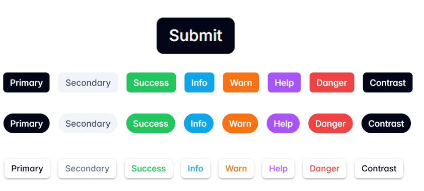
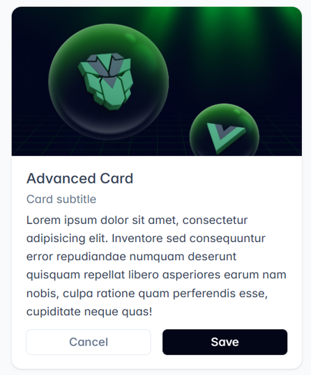
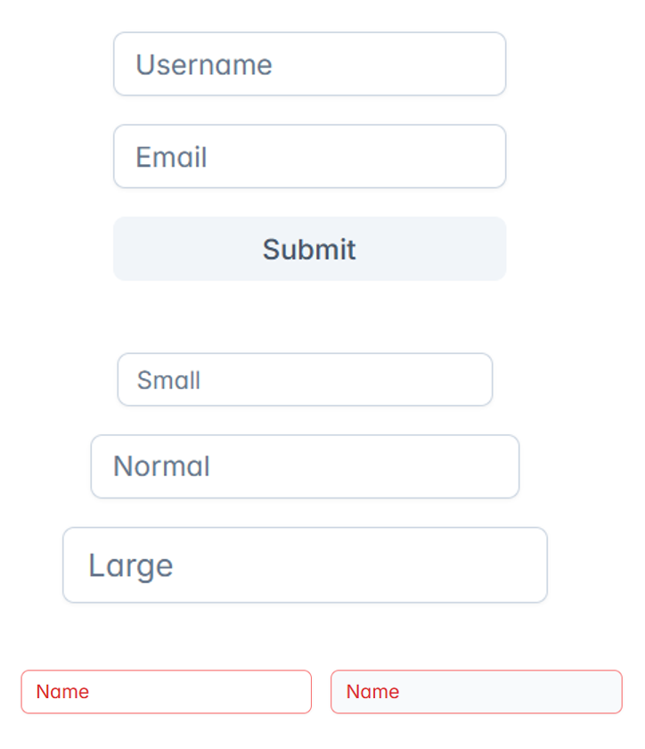
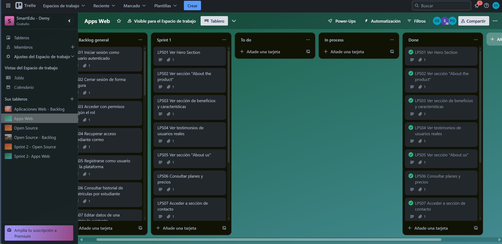
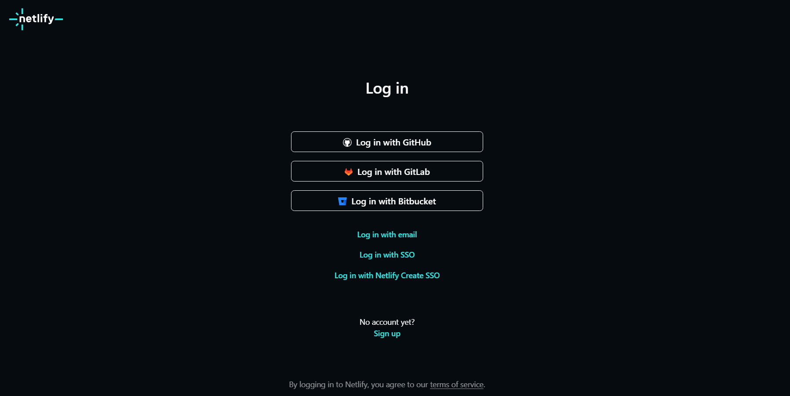
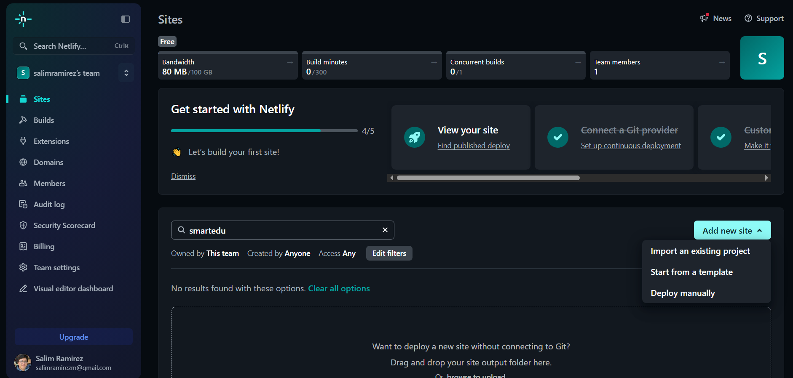
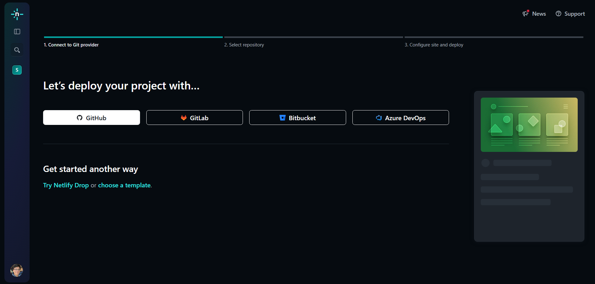
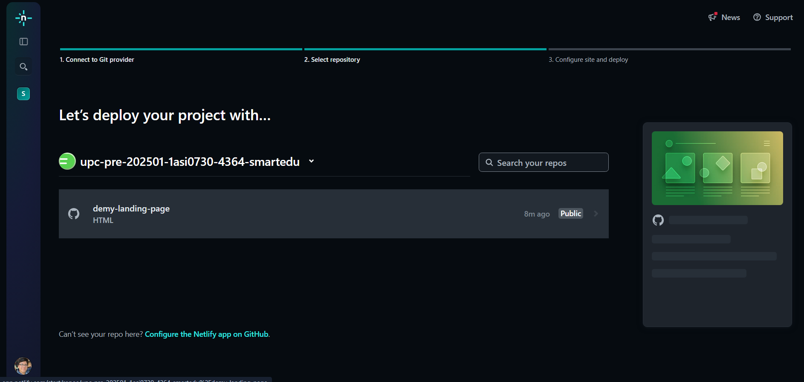
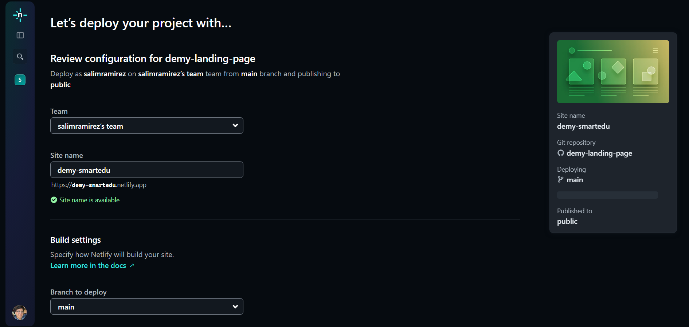
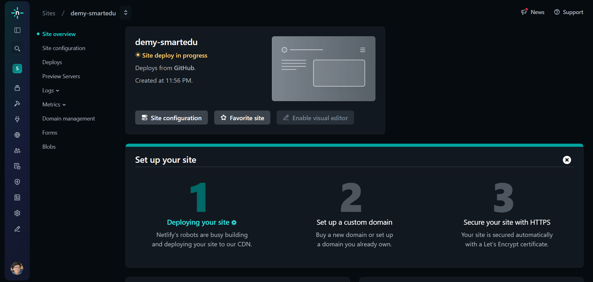

<h1 style="text-align: center;"> Informe TB1 </h1>
<h3 style="text-align: center;"> Universidad Peruana de Ciencias Aplicadas </h3>

<h5 style="text-align: center"> Ingeniería de Software </h5>

<h5 style="text-align: center"> 1ASI0729 - Aplicaciones Web</h5>

<h5 style="text-align: center"> Seccíón: 4364  </h5>

<h5 style="text-align: center"> Docente: Alex Humberto Sánchez Ponce </h5>

<h5 style="text-align: center"> Startup: SmartEdu </h5>

<h5 style="text-align: center"> Producto: Demy </h5>

<h2>Team members:</h2>

| Código     | Nombre                             |
|------------|------------------------------------|
| U20221G120 | Crispin Ramos, Daniel Franco       |
| U202312318 | Dominguez Vargas, Rafael Alexander |
| U20201E843 | Ramirez Mestanza, Salim Ignacio    |
| U20221C486 | Sulca Gonzales, Paúl Fernando      |
| U20231A778 | Vilca Saboya, Diego Alejandro      |

<h5 style="text-align: center"> Ciclo 2025-01 </h5>

# Registro de Versiones del Informe
| Versión | Fecha      | Autor                                                                                    | Descripción de modificación                                                                                                                                                                                                                                                                 |
|---------|------------|------------------------------------------------------------------------------------------|---------------------------------------------------------------------------------------------------------------------------------------------------------------------------------------------------------------------------------------------------------------------------------------------|
| 1.0     | 08/04/2025 | Salim Ramirez                                                                            | Creación inicial del documento de trabajo en formato Markdown para centralizar el desarrollo del informe final.                                                                                                                                                                             |
| 1.1     | 10/04/2025 | Paúl Sulca                                                                               | Se agregó la carátula, tabla de contenidos y la estructura básica del informe siguiendo las pautas del curso.                                                                                                                                                                               |
| 2.0     | 12/04/2025 | Daniel Crispin   Rafael Dominguez   Salim Ramirez   Paúl Sulca   Diego Vilca | Se completó el Capítulo I: Introducción. Se definieron objetivos, contexto, visión general del producto.                                                                                                                                                                                    |
| 2.1     | 12/04/2025 | Daniel Crispin   Rafael Dominguez   Salim Ramirez   Paúl Sulca   Diego Vilca | Se agregaron los resultados de entrevistas y análisis de competidores, como parte del Capítulo II.                                                                                                                                                                                          |
| 3.0     | 13/05/2025 | Daniel Crispin   Rafael Dominguez   Salim Ramirez   Paúl Sulca   Diego Vilca | Se completó el Capítulo II: Requirements Elicitation & Analysis, incluyendo personas, escenarios y requerimientos iniciales.                                                                                                                                                                |
| 3.1     | 16/05/2025 | Daniel Crispin   Rafael Dominguez   Salim Ramirez   Paúl Sulca   Diego Vilca | Se integraron las User Stories, Landing Page Stories y Technical Stories como parte del Capítulo III.                                                                                                                                                                                       |
| 4.0     | 18/05/2025 | Daniel Crispin   Rafael Dominguez   Salim Ramirez   Paúl Sulca   Diego Vilca | Se completó el Capítulo III: Requirements Specification, detallando los criterios de aceptación y modelo de casos de uso.                                                                                                                                                                   |
| 4.1     | 21/05/2025 | Daniel Crispin   Rafael Dominguez   Salim Ramirez   Paúl Sulca   Diego Vilca | Se añadieron los style guidelines, mockups, wireframes, wireflow y userflow en el Capítulo IV: Product Design.                                                                                                                                                                              |
| 5.0     | 23/05/2025 | Daniel Crispin   Rafael Dominguez   Salim Ramirez   Paúl Sulca   Diego Vilca | Se completó el Capítulo IV: Product Design, incluyendo arquitectura de componentes, estructura visual y navegación.                                                                                                                                                                         |
| 5.1     | 25/05/2025 | Daniel Crispin   Rafael Dominguez   Salim Ramirez   Paúl Sulca   Diego Vilca | Se desarrolló la sección de Software Configuration Management. Se añadió la planificación del Sprint 1.                                                                                                                                                                                     |
| 6.0     | 25/05/2025 | Daniel Crispin   Rafael Dominguez   Salim Ramirez   Paúl Sulca   Diego Vilca | Se completó el Capítulo V: Product Implementation, incluyendo evidencias de avance en el desarrollo de la Landing Page.                                                                                                                                                                     |

# Contenido

- [Capítulo I: Introducción](#capítulo-i-introducción)
    - [1.1. Startup Profile](#11-startup-profile)
        - [1.1.1. Descripción de la Startup](#111-descripción-de-la-startup)
        - [1.1.2. Perfiles de los integrantes del equipo](#112-perfiles-de-los-integrantes-del-equipo)
    - [1.2. Solution Profile](#12-solution-profile)
        - [1.2.1. Antecedentes y problemática](#121-antecedentes-y-problemática)
        - [1.2.2. Lean UX Process](#122-lean-ux-process)
            - [1.2.2.1. Lean UX Problem Statements](#1221-lean-ux-problem-statements)
            - [1.2.2.2. Lean UX Assumptions](#1222-lean-ux-assumptions)
            - [1.2.2.3. Lean UX Hypothesis](#1223-lean-ux-hypothesis)
            - [1.2.2.4. Lean UX Canvas](#1224-lean-ux-canvas)
    - [1.3. Segmentos objetivo](#13-segmentos-objetivo)

- [Capítulo II: Requirements Elicitation & Analysis](#capítulo-ii-requirements-elicitation--analysis)
    - [2.1. Competidores](#21-competidores)
        - [2.1.1. Análisis competitivo](#211-análisis-competitivo)
        - [2.1.2. Estrategias y tácticas frente a competidores](#212-estrategias-y-tácticas-frente-a-competidores)
    - [2.2. Entrevistas](#22-entrevistas)
        - [2.2.1. Diseño de entrevistas](#221-diseño-de-entrevistas)
        - [2.2.2. Registro de entrevistas](#222-registro-de-entrevistas)
        - [2.2.3. Análisis de entrevistas](#223-análisis-de-entrevistas)
    - [2.3. Needfinding](#23-needfinding)
        - [2.3.1. User Personas](#231-user-personas)
        - [2.3.2. User Task Matrix](#232-user-task-matrix)
        - [2.3.3. User Journey Mapping](#233-user-journey-mapping)
        - [2.3.4. Empathy Mapping](#234-empathy-mapping)
        - [2.3.5. As-is Scenario Mapping](#235-as-is-scenario-mapping)
    - [2.4. Ubiquitous Language](#24-ubiquitous-language)

- [Capítulo III: Requirements Specification](#capítulo-iii-requirements-specification)
    - [3.1. To-Be Scenario Mapping](#31-to-be-scenario-mapping)
    - [3.2. User Stories](#32-user-stories)
    - [3.3. Impact Mapping](#33-impact-mapping)
    - [3.4. Product Backlog](#34-product-backlog)

- [Capítulo IV: Product Design](#capítulo-iv-product-design)
    - [4.1. Style Guidelines](#41-style-guidelines)
        - [4.1.1. General Style Guidelines](#411-general-style-guidelines)
        - [4.1.2. Web Style Guidelines](#412-web-style-guidelines)
    - [4.2. Information Architecture](#42-information-architecture)
        - [4.2.1. Organization Systems](#421-organization-systems)
        - [4.2.2. Labeling Systems](#422-labeling-systems)
        - [4.2.3. SEO Tags and Meta Tags](#423-seo-tags-and-meta-tags)
        - [4.2.4. Searching Systems](#424-searching-systems)
        - [4.2.5. Navigation Systems](#425-navigation-systems)
    - [4.3. Landing Page UI Design](#43-landing-page-ui-design)
        - [4.3.1. Landing Page Wireframe](#431-landing-page-wireframe)
        - [4.3.2. Landing Page Mock-up](#432-landing-page-mock-up)
    - [4.4. Web Applications UX/UI Design](#44-web-applications-uxui-design)
        - [4.4.1. Web Applications Wireframes](#441-web-applications-wireframes)
        - [4.4.2. Web Applications Wireflow Diagrams](#442-web-applications-wireflow-diagrams)
        - [4.4.3. Web Applications Mock-ups](#443-web-applications-mock-ups)
        - [4.4.4. Web Applications User Flow Diagrams](#444-web-applications-user-flow-diagrams)
    - [4.5. Web Applications Prototyping](#45-web-applications-prototyping)
    - [4.6. Domain-Driven Software Architecture](#46-domain-driven-software-architecture)
        - [4.6.1. Software Architecture Context Diagram](#461-software-architecture-context-diagram)
        - [4.6.2. Software Architecture Container Diagrams](#462-software-architecture-container-diagrams)
        - [4.6.3. Software Architecture Components Diagrams](#463-software-architecture-components-diagrams)
    - [4.7. Software Object-Oriented Design](#47-software-object-oriented-design)
        - [4.7.1. Class Diagrams](#471-class-diagrams)
        - [4.7.2. Class Dictionary](#472-class-dictionary)
    - [4.8. Database Design](#48-database-design)
        - [4.8.1. Database Diagram](#481-database-diagram)

- [Capítulo V: Product Implementation, Validation & Deployment](#capítulo-v-product-implementation-validation--deployment)
    - [5.1. Software Configuration Management](#51-software-configuration-management)
        - [5.1.1. Software Development Environment Configuration](#511-software-development-environment-configuration)
        - [5.1.2. Source Code Management](#512-source-code-management)
        - [5.1.3. Source Code Style Guide & Conventions](#513-source-code-style-guide--conventions)
        - [5.1.4. Software Deployment Configuration](#514-software-deployment-configuration)
    - [5.2. Landing Page, Services & Applications Implementation](#52-landing-page-services--applications-implementation)
        - [5.2.1. Sprint 1](#521-sprint-1)
            - [5.2.1.1. Sprint Planning 1](#5211-sprint-planning-1)
            - [5.2.1.2. Aspect Leaders and Collaborators ](#5212-aspect-leaders-and-collaborators)
            - [5.2.1.3. Sprint Backlog 1](#5213-sprint-backlog-1)
            - [5.2.1.4. Development Evidence for Sprint Review](#5214-development-evidence-for-sprint-review)
            - [5.2.1.5. Execution Evidence for Sprint Review](#5215-execution-evidence-for-sprint-review)
            - [5.2.1.6. Services Documentation Evidence for Sprint Review](#5216-services-documentation-evidence-for-sprint-review)
            - [5.2.1.7. Software Deployment Evidence for Sprint Review](#5217-software-deployment-evidence-for-sprint-review)
            - [5.2.1.8. Team Collaboration Insights during Sprint](#5218-team-collaboration-insights-during-sprint)

- [Conclusiones](#conclusiones)
    - [Conclusiones y recomendaciones](#conclusiones-y-recomendaciones)
    - [Video About-the-Team](#video-about-the-team)
- [Bibliografía](#bibliografía)
- [Anexos](#anexos)

# Student Outcome

# Capítulo I: Introducción

## 1.1. Startup Profile

### 1.1.1. Descripción de la Startup

### 1.1.2. Perfiles de los integrantes del equipo

## 1.2. Solution Profile

git
### 1.2.1. Antecedentes y problemática

### 1.2.2. Lean UX Process

El Lean UX Process es una metodología ágil que nos permite diseñar soluciones centradas en el usuario, validando hipótesis mediante ciclos de prueba, retroalimentación y aprendizaje continuo.
En este proyecto, aplicamos este enfoque para resolver los desafíos administrativos que enfrentan las academias presenciales, partiendo de problemáticas reales y construyendo una plataforma que responda a sus necesidades.

#### 1.2.2.1 Lean UX Problem Statements

El servicio de Demy tiene como objetivo proporcionar a las instituciones educativas privadas una plataforma web integral que permita automatizar procesos administrativos esenciales, como matrículas, control de asistencia, asignación de horarios, docentes y salones, seguimiento de pagos y gestión de recursos y materiales.

El problema se manifiesta en la manera tradicional y desorganizada con la que muchas academias manejan su administración interna. Actualmente, la mayoría utiliza herramientas básicas como hojas de Excel, documentos físicos o plataformas que no están integradas entre sí. Esto genera duplicidad de tareas, falta de trazabilidad, pérdida de información clave, errores en la asignación de recursos y complicaciones en la gestión de pagos y control de asistencia. Como consecuencia, el personal administrativo invierte un tiempo excesivo en tareas repetitivas, y los docentes enfrentan dificultades para coordinar sus horarios o registrar adecuadamente la asistencia y rendimiento de los alumnos.

Hemos identificado que esta deficiencia en la administración limita seriamente la capacidad de crecimiento y profesionalización de muchas academias. Además, deteriora la experiencia de alumnos y profesores, y afecta negativamente la percepción del servicio ofrecido. La ausencia de un sistema unificado también impide tomar decisiones informadas sobre finanzas, rendimiento académico y uso de recursos, generando un impacto directo en la sostenibilidad del negocio.

¿Cómo podríamos centralizar y automatizar la gestión administrativa de academias presenciales de forma escalable y accesible, permitiendo al personal administrativo y docente ahorrar tiempo, reducir errores y mejorar el control sobre los procesos clave del día a día?

#### 1.2.2.2. Lean UX Assumptions

#### Business Assumptions

1. **Creemos que nuestros clientes necesitan** una plataforma web centralizada que les permita automatizar y simplificar su gestión administrativa diaria.
2. **Estas necesidades se pueden resolver con** un sistema web que facilite procesos clave como la matrícula de alumnos, control de asistencia, asignación de horarios, docentes y salones, gestión de inventario y seguimiento de pagos.
3. **Nuestros clientes iniciales serán** los administradores y docentes de academias educativas presenciales pequeñas, medianas y grandes que actualmente operan con métodos manuales o herramientas desarticuladas.
4. **El valor más importante que el cliente quiere de nuestro servicio es** tener mayor control y eficiencia en la administración de su academia, reduciendo la carga operativa y los errores humanos, y facilitando la toma de decisiones.
5. **El cliente también puede obtener beneficios adicionales** como recordatorios de pagos vencidos, seguimiento de inventario para reposición y escalabilidad mediante distintos planes por tamaño de academia.
6. **Vamos a adquirir la mayoría de nuestros clientes mediante** marketing digital dirigido en redes sociales (Facebook, Instagram, TikTok), campañas en Google Ads y alianzas con gremios educativos.
7. **Generaremos dinero a través de** un modelo de suscripción mensual escalable, con tres planes: Essentials $19.90 (academias pequeñas); Pro $69.90 (academias medianas); Elite $159.90 (academias grandes).
8. **Nuestra competencia principal en el mercado son** sistemas genéricos de gestión escolar, soluciones empresariales o especializadas y hojas de cálculo utilizadas por academias.
9. **Lo venceremos debido a** ofrecer una solución enfocada específicamente en academias presenciales, con una interfaz amigable, soporte local y funciones diseñadas desde el enfoque de sus procesos reales.
10. **El mayor riesgo del servicio es** que las academias, especialmente las pequeñas, no estén dispuestas a migrar desde sus métodos manuales actuales por temor al cambio o falta de conocimiento tecnológico.
11. **Resolveremos esto a través de** una interfaz simple y guiada, materiales de capacitación, soporte personalizado para la implementación, y un periodo de prueba gratuito para incentivar la adopción.

#### User Assumptions

**¿Quién es el usuario?**

Principalmente, el personal administrativo y los docentes de academias educativas que necesitan herramientas accesibles y prácticas para gestionar alumnos, horarios y pagos.

**¿Qué problema tiene nuestro producto que debe resolver?**

El problema radica en el desorden de los procesos administrativos, la pérdida de tiempo por tareas repetitivas, falta de visibilidad sobre pagos y asistencias.

**¿Qué características son importantes?**

Destacan principalmente el control de matrículas y asistencia, la asignación de horarios, salones y docentes, recordatorios de pagos vencidos e inventario con seguimiento de stock.

**¿Dónde encaja nuestro producto en su trabajo o vida?**

En el día a día laboral de los administradores y docentes, ayudándolos a organizar, controlar y optimizar la operación de su academia desde un solo lugar.

**¿Cúando y cómo es nuestro producto? ¿Usado?**

Será usado todos los días hábiles, especialmente al inicio de clases, al registrar asistencia, gestionar horarios o monitorear pagos.
Accederán desde computadoras o laptops, y en algunos casos desde tablets o smartphones.

**¿Cómo debe verse nuestro producto y cómo debe comportarse?**

Debe tener una interfaz moderna, clara y adaptable a cualquier dispositivo. La navegación debe ser intuitiva, con acciones guiadas y accesibles para usarlos sin conocimientos técnicos.
El sistema debe responder rápido, enviar notificaciones útiles y garantizar la seguridad de la información.

#### 1.2.2.3. Lean UX Hypothesis

- **Hypothesis 01:**

  **Creemos que** los administradores de academias presenciales estarán dispuestos a adoptar nuestra plataforma web para digitalizar procesos como matrícula, pagos, asistencia y asignación de horarios.

  **Sabremos que** hemos tenido éxito.

  **Cuando** al menos el 70% de los usuarios activos usen la plataforma para gestionar estos procesos durante el primer mes de uso, y al menos el 60% renueve su suscripción tras el primer ciclo mensual.

- **Hypothesis 02:**

  **Creemos que** la integración de recordatorios de morosidad y vencimiento de pagos reducirá significativamente el retraso en los pagos de los alumnos.

  **Sabremos que** hemos tenido éxito.

  **Cuando** el porcentaje de pagos vencidos disminuye en al menos un 40% entre los usuarios que adoptan esta funcionalidad en los primeros tres meses.

- **Hypothesis 03:**

  **Creemos que** permitir la gestión del inventario (como libros, plumones o equipos) dentro del sistema facilitará el control de materiales y reducirá pérdida o faltantes.

  **Sabremos que** hemos tenido éxito.

  **Cuando** al menos el 80% de las academias con más de una sede reporten una mejora en el seguimiento de materiales y una disminución de pérdidas en un periodo de 2 meses.

- **Hypothesis 04:**

  **Creemos que** la interfaz intuitiva y el diseño responsivo de la plataforma aumentará la frecuencia de uso por parte de docentes y personal administrativo, incluso si no tienen experiencia tecnológica previa.

  **Sabremos que** hemos tenido éxito.

  **Cuando** al menos el 75% de los usuarios califiquen la usabilidad de la plataforma como "fácil" o "muy fácil" en las encuestas de satisfacción realizadas durante la fase piloto.

- **Hypothesis 05:**

  **Creemos que** ofrecer planes escalables (Essentials, Pro, Elite) permitirá a las academias elegir el plan adecuado según su tamaño, y facilitará el crecimiento dentro del mismo sistema.

  **Sabremos que** hemos tenido éxito.

  **Cuando** al menos el 25% de los clientes del plan Essentials migren al plan Pro o Elite en los primeros seis meses de uso.

#### 1.2.2.4. Lean UX Canvas

El Lean UX Canvas nos permite organizar de forma clara y colaborativa los elementos clave del diseño: problema, usuarios, suposiciones, hipótesis y métricas.
En este proyecto, nos ayuda a enfocar el desarrollo en generar valor real para las academias educativas.
A continuación se presenta el Lean UX Canvas elaborado en la herramienta Miro.

*Figura 1. Lean UX Canvas del proyecto.*

**Enlace al Lean UX Canvas:** [Ver en Miro](https://miro.com/app/board/uXjVIGPrhA0=/?share_link_id=155958536023)

## 1.3. Segmentos objetivo

# Capítulo II: Requirements Elicitation & Analysis

## 2.1. Competidores

### 2.1.1. Análisis competitivo
Esta sección tiene objetivo conocer mejor los competidores a los que se enfrentará SmartEDU y poder así comparar nuestros beneficios.

|**Competitive Analysis Landscape** |                             |                   
|-----------------------------------|-----------------------------|
| ¿Por qué llevar acabo este análisis?| El objetivo de este análisis competitivo es saber como será nuestro posicionamiento en el mercado en comparación a otros sistema de gestión de academias y que será lo que nos hará destacar|

|                     |                                                                           | SmartEdu                                                                                                                                                                                                                          |    Academygest                                                                                       |    Playoff                                                                                                                                                                                                                     |    Quickschools                                                                                                                                                                                                           |
|---------------------|---------------------------------------------------------------------------|-----------------------------------------------------------------------------------------------------------------------------------------------------------------------------------------------------------------------------------|------------------------------------------------------------------------------------------------------------------------------------------------------------------------|------------------------------------------------------------------------------------------------------------------------------------------------------------------------------------------------------------------------------------------------------------------------------------------|-----------------------------------------------------------------------------------------------------------------------------------------------------------------------------------------------------------------------------------------------------------------------------------------------|
| Perfil              | Overview                                                                  | SmartEdu ofrece a Demy, un sistema web integral que facilita la organización, carga operativa y mejora la experiencia tanto de alumnos como docentes.                                                                             | Plataforma integral que facilita la gestión de academias y centros educativos, permitiendo organizar y mantener datos de alumnos.                                      | Sistema de gestión para entidades, que una de sus opciones es un enfoque a academias, ofreciendo cosas como control de cobros y pagos junto a organización de actividades                                                                                                                | QuickSchools es una plataforma en la nube para gestionar escuelas, con funciones como calificaciones, asistencia y comunicación con padres. Está pensada para instituciones pequeñas y medianas.                                                                                              |
|                     | Ventaja   competitiva   ¿Qué valor   ofrece a los   clientes? | Solución integral y escalable para la administración de academias, que a la vez tendrá mucha accesibilidad ofrenciendo diferentes de acuerdo a que le convenga más a la academia                                                  | Optimización de la gestión administrativa, ahorro de tiempo y mejora de la eficiencia en la administración de academias y centros educativos.                          | Mejora de la motivación y participación en programas de formación y gestión mediante dinámicas de juego personalizadas                                                                                                                                                                   | Solución accesible y flexible para la gestión administrativa y académica, con un enfoque en facilidad de uso y personalización.                                                                                                                                                               |
| Perfil de marketing | Mercado objetivo                                                          | Academia presenciales preuniversitarias ( con una sede o varias sedes)                                                                                                                                                            | Academias y centros de formación en España, enfocados en cursos profesionales o empresariales, que requieren control académico, administrativo y financiero.           | Playoff está dirigido a entidades educativas, corporativas y de formación que buscan aumentar la motivación y participación mediante gamificación.                                                                                                                                       | Escuelas pequeñas y medianas a nivel global (como colegios K-12 y privados) que necesitan una solución simple y flexible para gestionar procesos académicos.                                                                                                                                  |
|                     | Estrategias de Marketing                                                  | Ofrece anuncios en la televesión, junto a redes sociales como tiktok,instagram o facebook.                                                                                                                                        | Campañas en línea enfocadas en instituciones educativas que buscan soluciones de gestión                                                                               | Publica artículos,estudios de caso y guías sobre la implementación efectiva de estrategia de gamificación en empresas   Muestra casos de uso de como la gamificación                                                                                                                  | Ofrece guías para atraer y retener clientes potenciales interesados en su mejora de procesos educativos                                                                                                                                                                                       |
| Perfil de producto  | Productos & Servicios                                                     | Registro y matrícula de alumnos   Automatizacíon de gestión de pagos y suscripciones   Toma de asistencia   Gestión de inventario                                                                                        | Control de asistencia de alumnos   Gestión de pagos como cobros y finanzas   Gestión de informes    Envío de SMS  a los alumnos                               | Plataforma de gamificación   Gamificación educativa   Análisis y reportes de la participacíon y el progreso   Customización de experiencias:personalizacíon de la plataforma según la entidad, ya sea Academias o empresas                                                      | Herramientas para siempre mantener informado a los padres y estudiantes   Un gradebook personalizado   Horario de clases inteligente                                                                                                                                                 |
|                     | Precios y Costos                                                          | Plan Básico:  \$50 / mes , dirigido a pequeñas academias ( 1 sede).   Plan Intermedio: $100 /mes , dirigido a academias medianas (2 sedes)   Plan Premium: \$200, dirigido a academias grandes ( varias sedes)              | 25€  /mes, que incluye : - Sin instalaciones  - 24 horas del día disponible   -Alumnos y cursos ilimitados   -Asistencia de Alumnos   Soporte técnico | Incluye 15 días de prueba gratuita, por otro lado los planes son:  Plan Base( 34,95€), para los que empiezan   Plan pro (49,95€), para los que llevan poco  Plan Top ( 69,95€) para los veteranos  Plan Premium ( tarifa personalizada), acuerdo a tratar con la empresa | Gaia Plan ( \$0.99) por estudiante por mes  Apollo Plan ( $1.49) por estudiante por mes   Athena plan (\$2.99) por estudiante por mes   Todos los planes incluyen una prueba gratuita de 30 días,  además puedes ponerte en contacto con quickschools para un Enterprise Plan |
|                     | Canales de distribución   Web o móvil                                  | Demy actualmente solo se distribuye exclusivamente en Web                                                                                                                                                                         | Solo disponible a través de navegadores web                                                                                                                            | Se distribuye de manera web pero con el Plan Pro tendrás acceso a la app móvil.                                                                                                                                                                                                          | Se distribuye de manera web y móvil.                                                                                                                                                                                                                                                          |
| Análisis Swot       | Fortalezas                                                                | Incluye varios planes de acuerdo al alcance de la academia   Producto especializado en academias preuniversitarias                                                                                                        | Plataforma integral especializada en academias pequeñas y medianas.   Interfaz intuitiva y en idioma español   Cobertura de funciones básicas de gestión         | Especialización en gamificación, un campo en crecimiento   Altamante adaptable a distintos sectores ( Academias, RRHH, ventas)                                                                                                                                                   | Plataforma madura, flexible y con planes escalables   Soporte al cliente efectivo                                                                                                                                                                                                     |
|                     | Debilidades                                                               | SmartEdu al ser una startup emergente no cuenta con mucho financiamiento   No cuenta con una app móvil                                                                                                                    | No cuenta con una app móvil   Se limite presencialmente a españa   Menor reconocimiento frente a competidores globales                                         | No es una solución académica integral, más bien un complemento  Requiere personalización técnica    La app móvil es solo accesible a partir de un cierto plan                                                                                                                | Puede resultar costo a gran escala si no se optimiza el uso   Limitado al idioma inglés                                                                                                                                                                                                   |
|                     | Oportunidades                                                             | Poca competencia en el segmento objetivo   Aumento en el uso de la tecnología luego del COVID-19                                                                                                                          | Ampliar su presencia a latinomerica   Incorporar una app móvil para una buena complementación y accesibilidad                                                  | Amplicación creciente de la gamificacíon en la actualidad  Alianza con plataforams educativas para ofrecer gamificacíon integrada                                                                                                                                                | Incluir el idioma español para ser más global     Alianzas con gobiernos o redes escolares                                                                                                                                                                                                |           
|                     | Amenazas                                                                  | Resistencia al cambio tecnológico de parte de algunas academias   Soluciones muy fuertes de otros competidores   Posibles ciberataques, ya que la startup no tiene mucho conocimiento sobre la ciberseguridad actualmente | Dependencia de un solo mercado geográfico   Competencia con soluciones globales más completas y flexibles                                                          | Dependencia de clientes que comprendan el valor de la gamificación                                                                                                                                                                                                                   | Compite con plataformas globables que incluye varios idiomas   Riesgo de saturación en el mercado K-12                                                                                                                                                                                    |
 

### 2.1.2. Estrategias y tácticas frente a competidores
Para competir eficazmente en el mercado de plataformas de gestión para academias presenciales, SmartEdu aplicará las siguientes estrategias y tácticas preliminares, considerando sus propias fortalezas y debilidades, así como el contexto de oportunidades y amenazas en relación a sus competidores:

* Diferenciación por enfoque especializado  
  **Estrategia**: Posicionar a Demy como la plataforma especializada en academias preuniversitarias presenciales, a diferencia de otros competidores que ofrecen soluciones más genéricas o centradas en colegios o empresas.
   
  **Tácticas**:Desarrollar funcionalidades específicas para academias preuniversitarias, como módulos de simulacros, cronogramas de preparación para exámenes de admisión

 

* Modelo de precios escalables
   
  **Estrategia**:Mantener un esquema de precios accesible, con planes diferenciados según el tamaño de la academia, y con mejor relación calidad-precio frente a competidores como QuickSchools o Playoff.
   
  **Tácticas**: Evaluar una prueba gratuita de n días , Ofrecer descuentos cada cierto tiempo o evaluar una contratación anual incluida con descuento

 

* Mejora progresiva del producto y adaptabilidad
   
  **Estrategia**:Competir frente a soluciones más maduras (como QuickSchools) con un enfoque ágil y adaptable, incorporando mejoras constantes con base en la retroalimentación directa de los usuarios.
   
  **Tácticas**: Lanzamientos de mejoras mensuales (por sprints) , futura implementación de la versión móvil.

 

*  Seguridad y confianza
    
   **Estrategia**:  Reducir la percepción de riesgo en torno a ciberseguridad, una amenaza para startups, generando confianza desde etapas tempranas.
    
   **Táctica**:Contratar un servicio externo para auditorías de seguridad básicas.

 

* Aprovechamiento del contexto post-pandemia
   
  **Estrategia**: Capitalizar el aumento de la digitalización en la educación tras el COVID-19 para incentivar la transformación digital de academias tradicionales
   
  **Tácticas**: Ofrecer workshops gratuitos virtuales sobre “Digitaliza tu academia en 3 pasos con Demy”. Enseñar casos de éxito que muestren cómo academias presenciales mejoraron su eficiencia tras usar la plataforma.

## 2.2. Entrevistas

En esta sección se aborda la investigación cualitativa realizada mediante entrevistas a representantes de los segmentos objetivo del proyecto: administrativos y docentes de academias educativas.
El objetivo fue comprender las herramientas, procesos y problemáticas actuales en su gestión, así como validar posibles soluciones digitales a partir de sus propias experiencias.

### 2.2.1. Diseño de entrevistas

Para diseñar las entrevistas, se elaboraron dos bloques de preguntas, diferenciados según el segmento objetivo.
Las preguntas buscaban obtener tanto información objetiva (como el contexto de trabajo y herramientas utilizadas) como información subjetiva (percepciones, frustraciones y expectativas respecto a posibles soluciones).

---

#### **Segmento 1: Administrativos de academias**

**Preguntas sobre la problemática**

1. ¿Cómo gestionan actualmente los procesos administrativos como matrículas, horarios, pagos y asistencia?

2. ¿Qué problemas frecuentes enfrentas con las herramientas o métodos que usas hoy?

3. ¿Qué tipo de información necesitas consultar con frecuencia, y qué tan fácil es acceder a ella?

4. ¿Qué consecuencias trae la desorganización o errores en la administración para ti o tu equipo?

**Preguntas sobre la solución**

1. ¿Qué funcionalidades crees que debería tener una herramienta ideal para facilitar tu trabajo administrativo?

2. ¿Qué tan importante sería para ti recibir alertas sobre tareas o pagos?

3. ¿Preferirías un sistema con muchas funciones o uno más simple pero fácil de usar?

4. ¿Qué beneficios esperas obtener si decides adoptar una nueva plataforma de gestión?

5. ¿Estarías dispuesto a aprender a usar una nueva herramienta si mejora tu gestión (organización)?

---

#### **Segmento 2: Docentes de academias**

**Preguntas sobre la problemática**

1. ¿Qué herramientas o métodos usas para registrar asistencia o notas en caso lo hagas? ¿Funcionan bien para usted?

2. ¿Qué tipo de coordinación tiene con el personal administrativo? ¿Es fácil comunicarse con ellos o enfrenta dificultades?

3. ¿Cómo accedes a la información de tus clases o alumnos cuando la necesitas?

4. ¿Cómo manejas los cambios de aula, horarios u otras incidencias en tu día a día?

**Preguntas sobre la solución**

1. ¿Qué funcionalidades te gustaría que tenga una herramienta digital para docentes?

2. ¿Qué tan útil sería para ti revisar tu horario o registrar asistencia desde cualquier dispositivo?

3. ¿Qué tan importante es que la plataforma sea fácil de usar e intuitiva?

4. ¿Preferirías acceder a la plataforma desde tu celular, tablet o computadora?

5. ¿Qué tan valioso sería que recibas alertas (notificaciones) sobre cambios de horario o asistencia irregular, y demás?

6. ¿Estarías dispuesto a aprender a usar una nueva herramienta si mejora tu gestión (organización)?

### 2.2.2. Registro de entrevistas

#### Segmento: Docente - Entrevistado 2

| Atributo                | Detalle                                                                                                                                                                                                                                                                                                                                                                                                                                                                                                                                                                                                                                                                                                                                                                                                                                                                                                   |
|-------------------------|-----------------------------------------------------------------------------------------------------------------------------------------------------------------------------------------------------------------------------------------------------------------------------------------------------------------------------------------------------------------------------------------------------------------------------------------------------------------------------------------------------------------------------------------------------------------------------------------------------------------------------------------------------------------------------------------------------------------------------------------------------------------------------------------------------------------------------------------------------------------------------------------------------------|
| **Nombre**              | Jean Paul Benezú                                                                                                                                                                                                                                                                                                                                                                                                                                                                                                                                                                                                                                                                                                                                                                                                                                                                                          |
| **Edad**                | 21 años                                                                                                                                                                                                                                                                                                                                                                                                                                                                                                                                                                                                                                                                                                                                                                                                                                                                                                   |
| **Sexo**                | Masculino                                                                                                                                                                                                                                                                                                                                                                                                                                                                                                                                                                                                                                                                                                                                                                                                                                                                                                 |
| **Distrito**            | Santa Anita                                                                                                                                                                                                                                                                                                                                                                                                                                                                                                                                                                                                                                                                                                                                                                                                                                                                                               |
| **Ocupación**           | Docente en CEPRE Agraria                                                                                                                                                                                                                                                                                                                                                                                                                                                                                                                                                                                                                                                                                                                                                                                                                                                                                  |
| **Fecha de entrevista** | 08 de abril del 2025                                                                                                                                                                                                                                                                                                                                                                                                                                                                                                                                                                                                                                                                                                                                                                                                                                                                                      |
| **Duración**            | 14:46 minutos                                                                                                                                                                                                                                                                                                                                                                                                                                                                                                                                                                                                                                                                                                                                                                                                                                                                                             |
| **Captura**             |                                                                                                                                                                                                                                                                                                                                                                                                                                                                                                                                                                                                                                                                                                                                                                                                                                         |
| **Video**               | [Ver en Microsoft Stream](https://upcedupe-my.sharepoint.com/:v:/g/personal/u20201e843_upc_edu_pe/EWQAxTMJq4tJpIHJ90rbWfYBCZKPnkxth6JTmDrxSy7_1Q?nav=eyJyZWZlcnJhbEluZm8iOnsicmVmZXJyYWxBcHAiOiJPbmVEcml2ZUZvckJ1c2luZXNzIiwicmVmZXJyYWxBcHBQbGF0Zm9ybSI6IldlYiIsInJlZmVycmFsTW9kZSI6InZpZXciLCJyZWZlcnJhbFZpZXciOiJNeUZpbGVzTGlua0NvcHkifX0&e=FIc2F9)                                                                                                                                                                                                                                                                                                                                                                                                                                                                                                                                                    |
| **Resumen**             | El entrevistado enseña en una academia preuniversitaria y usa Excel para registrar notas y asistencia, además de Google Forms en algunos casos. Si bien la comunicación con el personal administrativo es buena, ha experimentado dificultades al reprogramar clases debido a la baja asistencia en días especiales, por lo que realiza encuestas para reagendar. Considera fundamental contar con una herramienta centralizada que le permita registrar notas y asistencia de forma ordenada. Valora altamente que la plataforma sea intuitiva, visualmente simple y accesible desde su celular. También sugiere que padres o tutores puedan acceder a la información. Aunque no le interesa recibir alertas por notas o asistencia, considera clave recibir notificaciones por cambios de horario. Está dispuesto a aprender a usar nuevas herramientas si percibe una mejora real en su productividad. |

#### Segmento: Docente - Entrevistado 3

| Atributo                | Detalle                                                                     |
|-------------------------|-----------------------------------------------------------------------------|
| **Nombre**              | Jeff Aylas Quispe Vergara                                                   |
| **Edad**                | 25                                                                          |
| **Sexo**                | Masculino                                                                   |
| **Distrito**            | San Juan de Lurigancho                                                      |
| **Ocupación**           | Docente en Academia ADUNI                                                   |
| **Fecha de entrevista** | 11 de abril del 2025                                                        |
| **Duración**            | 4:28 minutos                                                                |
| **Captura**             |           |
| **Video**               | [Ver en Microsoft Stream](https://upcedupe-my.sharepoint.com/personal/u20201e843_upc_edu_pe/_layouts/15/stream.aspx?id=%2Fpersonal%2Fu20201e843%5Fupc%5Fedu%5Fpe%2FDocuments%2FDemy%2FEntrevistas%2Fvideo%2Dentrevista%2Ddocente3%2Emp4&referrer=StreamWebApp%2EWeb&referrerScenario=AddressBarCopied%2Eview%2E6dbf826d%2Dd312%2D4e22%2Dadea%2D45cb75a98def)                                                 |
| **Resumen**             | El docente entrevistado, que además es estudiante, utiliza principalmente herramientas como hojas de Excel o cuadernos para registrar asistencia y notas, aunque reconoce que no siempre son prácticas ni eficientes. La coordinación con el personal administrativo se da por canales informales como WhatsApp o correo, lo que a veces genera demoras y falta de claridad. El acceso a la información de clases o alumnos no está centralizado, lo que le obliga a recurrir a sus apuntes o hacer consultas adicionales. Los cambios de aula o horario suelen comunicarse de manera improvisada, lo que puede causar confusión. Valora la posibilidad de contar con una herramienta digital que integre funciones clave como registro de asistencia, horarios, notas y observaciones, accesible desde cualquier dispositivo, especialmente el celular. Considera fundamental que la plataforma sea fácil de usar e intuitiva, ya que si es compleja, volvería a sus métodos tradicionales. Además, percibe como muy útil recibir alertas sobre incidencias o comportamientos irregulares. Está dispuesto a adoptar una nueva herramienta siempre que le facilite la gestión y no represente una carga adicional de aprendizaje. |

### 2.2.3. Análisis de entrevistas

## 2.3. Needfinding

El Needfinding permite identificar necesidades reales de los usuarios mediante entrevistas y análisis del contexto.
A partir de esta información, se construyeron artefactos clave que ayudaron a comprender mejor sus objetivos, tareas, emociones y frustraciones.

### 2.3.1. User Personas

Los User Personas fueron elaborados a partir de los hallazgos de las entrevistas, reflejando perfiles representativos de los segmentos objetivo.
Cada ficha sintetiza aspectos demográficos, conductuales y emocionales que guían el diseño funcional y visual de la plataforma.

---

#### User Persona: Administrador de academia

Coordinadora administrativa que necesita centralizar pagos, matrículas y horarios.
Busca evitar errores, ahorrar tiempo y modernizar los procesos de su academia.

**Figura 2.** User Persona del segmento *Administrador*.

---

#### User Persona: Docente de academia

Profesor joven que busca herramientas simples y accesibles para gestionar asistencia y horarios desde cualquier dispositivo, sin depender de su laptop.
Valora la movilidad y odia perder tiempo con tareas repetitivas.

**Figura 3.** User Persona del segmento *Docente*.

---

### 2.3.2. User Task Matrix

### 2.3.3. User Journey Mapping
A continuación se presentarán los User Journey Maps de cada User Persona. Estos mapas nos permitirán comprender los puntos de dolor que experimentan en cada etapa, desde que descubren nuestra app hasta que comparten su opinión sobre ella.

* User Journey Map de Luis Mendoza:

[Ver Imagen detallada aquí](https://drive.google.com/file/d/1ZwP-W8qpUPP0yI6UFXMareIiCiphqNrr/view?usp=sharing)

* User Journey Map de Carmen Gutiérrez:

[Ver Imagen detallada aquí](https://drive.google.com/file/d/1oGSadSkVdSIzf-MeaMGnYL06wVVFKkJG/view?usp=sharing)

### 2.3.4. Empathy Mapping

### 2.3.5. As-Is Scenario Mapping

## 2.4. Ubiquitous Language

# Capítulo III: Requirements Specification

## 3.1. To-Be Scenario Mapping.

## 3.2. User Stories

Se elaboraron historias de usuario (US), técnicas (TS) y de sitio web estático (LPS) para el sistema Demy, siguiendo buenas prácticas como INVEST. Estas historias reflejan necesidades reales de los usuarios y están organizadas por épicas, cada una con sus respectivos criterios de aceptación.

| Epic / Story ID | Título                                   | Descripción                                                                                                                            | Criterios de Aceptación                                                                                                                                                                                                                                                                                                                                                                              | Relacionado con (Epic ID) |
|-----------------|------------------------------------------|----------------------------------------------------------------------------------------------------------------------------------------|------------------------------------------------------------------------------------------------------------------------------------------------------------------------------------------------------------------------------------------------------------------------------------------------------------------------------------------------------------------------------------------------------|---------------------------|
| EP01            | Gestión de usuarios y autenticación      | Login, gestión de sesiones y control de acceso a funcionalidades según el rol del usuario.                                             | — *(Epica, no aplica)*                                                                                                                                                                                                                                                                                                                                                                               | —                         |
| EP02            | Gestión de matrículas                    | Funcionalidades para registrar, editar y consultar matrículas de estudiantes.                                                          | — *(Epica, no aplica)*                                                                                                                                                                                                                                                                                                                                                                               | —                         |
| EP03            | Control de asistencia y rendimiento      | Registro de asistencia por parte del docente y consulta del estado por parte del administrativo.                                       | — *(Epica, no aplica)*                                                                                                                                                                                                                                                                                                                                                                               | —                         |
| EP04            | Gestión financiera y alertas de pago     | Control de pagos realizados por estudiantes, alertas de morosidad y registro básico de egresos.                                        | — *(Epica, no aplica)*                                                                                                                                                                                                                                                                                                                                                                               | —                         |
| EP05            | Gestión de horarios y asignaciones       | Asignación y reprogramación de horarios, salones y docentes según disponibilidad o cambios imprevistos.                                | — *(Epica, no aplica)*                                                                                                                                                                                                                                                                                                                                                                               | —                         |
| EP06            | Accesos desde Landing Page por segmento  | Redirecciones desde la landing page hacia vistas específicas según el tipo de visitante.                                               | — *(Epica, no aplica)*                                                                                                                                                                                                                                                                                                                                                                               | —                         |
| EP07            | Servicios técnicos y APIs REST           | Implementación y documentación de endpoints RESTful, configuración del backend y aspectos técnicos.                                    | — *(Epica, no aplica)*                                                                                                                                                                                                                                                                                                                                                                               | —                         |
| US01            | Iniciar sesión como usuario del sistema  | Como usuario registrado, quiero iniciar sesión en el sistema, para acceder a mis funcionalidades según mi rol.                         | Given el formulario de login está disponible When el usuario ingresa credenciales válidas Then se muestra la pantalla de inicio correspondiente a su rol And se almacena un token de sesión válido                                                                                                                                                                                          | EP01                      |
| US02            |                                          |                                                                                                                                        |                                                                                                                                                                                                                                                                                                                                                                                                      |                           |
| US03            |                                          |                                                                                                                                        |                                                                                                                                                                                                                                                                                                                                                                                                      |                           |
| US04            |                                          |                                                                                                                                        |                                                                                                                                                                                                                                                                                                                                                                                                      |                           |
| US05            |                                          |                                                                                                                                        |                                                                                                                                                                                                                                                                                                                                                                                                      |                           |
| US06            |                                          |                                                                                                                                        |                                                                                                                                                                                                                                                                                                                                                                                                      |                           |
| US07            |                                          |                                                                                                                                        |                                                                                                                                                                                                                                                                                                                                                                                                      |                           |
| US08            |                                          |                                                                                                                                        |                                                                                                                                                                                                                                                                                                                                                                                                      |                           |
| US09            |                                          |                                                                                                                                        |                                                                                                                                                                                                                                                                                                                                                                                                      |                           |
| US10            |                                          |                                                                                                                                        |                                                                                                                                                                                                                                                                                                                                                                                                      |                           |
| US11            |                                          |                                                                                                                                        |                                                                                                                                                                                                                                                                                                                                                                                                      |                           |
| US12            |                                          |                                                                                                                                        |                                                                                                                                                                                                                                                                                                                                                                                                      |                           |
| US13            |                                          |                                                                                                                                        |                                                                                                                                                                                                                                                                                                                                                                                                      |                           |
| US14            |                                          |                                                                                                                                        |                                                                                                                                                                                                                                                                                                                                                                                                      |                           |
| US15            |                                          |                                                                                                                                        |                                                                                                                                                                                                                                                                                                                                                                                                      |                           |
| US16            |                                          |                                                                                                                                        |                                                                                                                                                                                                                                                                                                                                                                                                      |                           |
| US17            |                                          |                                                                                                                                        |                                                                                                                                                                                                                                                                                                                                                                                                      |                           |
| US18            | Crear materias por periodo de estudio    | Como administrativo quiero crear materias por periodo de estudio  para mantener un control claro del contenido académico en cada ciclo | Given que el usuario tiene rol administrativo   When ingresa a su organización   And presiona el botón " Periodos"   And presiona el botón Gestión de materias   And registra los datos de su nueva materia  Then el sistema muestra un mensaje de confirmación                                                                                                                     | EP05                      |
| US19            | Asignar horarios a los docentes y cursos | Como administrativo quiero asignar horarios a los docentes y cursos para evitar conflictos de disponibilidad                           | Given que el usuario tiene rol administrativo   And existe una materia registrada en el periodo   When el usuario asigna el horario al curso   And selecciona el docente   Then el sistema guarda el registro exitosamente And muestra un mensaje de confirmación                                                                                                                | EP05                      |
| US20            | Consultar disponibilidad de salones      | Como administrativo quiero consultar la disponibilidad de salones para asignar clases de manera eficiente                              | Given que el usuario tiene rol administrativo    And accede a la gestión de salones   When seleccione el rango de hora que desea disponible   Then el sistema muestra una lista de salones en el horario disponible                                                                                                                                                                      | EP05                      |
| US21            | Reprogramar clase por cambio de horario  | Como docente quiero reprogramar la clase por cambio de horario para garantizar el aprendizaje de mis alumnos sin retrasos              | Given que el usuario tiene rol docente   And accede a la gestión de clases   And selecciona reprogramación de clases   And selecciona la hora en la que desea recuperar   And el sistema le muestra los salones disponibles a la hora que desea recuperar   When el docente selecciona el salón disponible   Then el sistema le muestra un mensaje de reprogramación exitosa | EP05                      |
| US22            | Actualizar calendario del docente        | Como docente quiero visualizar automáticamente la reprogramación  de la clase en mi horario para estar siempre al tanto de ello        | Given que el usuario tiene rol docente   And tiene una clase reprogramada   When acceda a su visualización de horario   Then el sistema le muestra su horario actualizado con la clase reprogramada                                                                                                                                                                                      | EP05                      |
| LPS01           |                                          |                                                                                                                                        |                                                                                                                                                                                                                                                                                                                                                                                                      |                           |
| LPS02           |                                          |                                                                                                                                        |                                                                                                                                                                                                                                                                                                                                                                                                      |                           |
| LPS03           |                                          |                                                                                                                                        |                                                                                                                                                                                                                                                                                                                                                                                                      |                           |
| LPS04           |                                          |                                                                                                                                        |                                                                                                                                                                                                                                                                                                                                                                                                      |                           |
| LPS05           |                                          |                                                                                                                                        |                                                                                                                                                                                                                                                                                                                                                                                                      |                           |
| LPS06           |                                          |                                                                                                                                        |                                                                                                                                                                                                                                                                                                                                                                                                      |                           |
| LPS07           |                                          |                                                                                                                                        |                                                                                                                                                                                                                                                                                                                                                                                                      |                           |
| LPS08           |                                          |                                                                                                                                        |                                                                                                                                                                                                                                                                                                                                                                                                      |                           |
| LPS09           |                                          |                                                                                                                                        |                                                                                                                                                                                                                                                                                                                                                                                                      |                           |
| LPS10           |                                          |                                                                                                                                        |                                                                                                                                                                                                                                                                                                                                                                                                      |                           |
| TS01            |                                          |                                                                                                                                        |                                                                                                                                                                                                                                                                                                                                                                                                      |                           |
| TS02            |                                          |                                                                                                                                        |                                                                                                                                                                                                                                                                                                                                                                                                      |                           |
| TS03            |                                          |                                                                                                                                        |                                                                                                                                                                                                                                                                                                                                                                                                      |                           |
| TS04            |                                          |                                                                                                                                        |                                                                                                                                                                                                                                                                                                                                                                                                      |                           |
| TS05            |                                          |                                                                                                                                        |                                                                                                                                                                                                                                                                                                                                                                                                      |                           |

## 3.3. Impact Mapping

## 3.4. Product Backlog

# Capítulo IV: Product Design

## 4.1. Style Guidelines

### 4.1.1. General Style Guidelines

### 4.1.2. Web Style Guidelines

En esta sección explicaremos y mostraremos de manera **referencial** las decisiones sobre los estándares visuales y de interacción aplicados a las interfaces web responsivas, desarrolladas con Vue.js y la biblioteca de componentes PrimeVue 
  

Las decisiones tomadas buscan garantizar una experiencia de usuario coherente, accesible y visualmente armónica en todos los dispositivos. Además, sacaremos provecho de los componentes que nos ofrece Primevue, entre ellos los que más destacamos son:
 

* **Buttons**: Para los botones de acción dentro de la aplicación se utilizarán los componentes Buttons de PrimeVue, con sus diferentes variantes las cuales no permitirá usar en muchas secciones.   
A continuación, se ilustra el estilo visual de manera referencial que tendrá en la aplicación web.

* **Cards**: Para presentar información agrupada de manera visual, se utilizarán los componentes Card, los cuales permiten incluir títulos, subtítulos, imágenes y acciones dentro de un contenedor estilizado. 
Haremos uso de ellas en varias vistas como la de los planes mensuales que ofrece la aplicación  
A continuación, se ilustra de manera referencial los cards a implementar en la aplicación web sacado de la documentación oficial de PrimeVue.

* **Forms**: Los formularios no pueden faltar en ninguna aplicación web, se usa tanto para el logueo de la app o rellenar cualquier campo de información necesario como el registro de una materia para tal periodo académico. 
Para ello, haremos uso de componentes como InputText, TextArea, CascadaSelect, etc.  
A continuación, se ilustra de manera referencial los input texts a implementar en la aplicación web sacado de la documentación oficial de PrimeVue.

## 4.2. Information Architecture

### 4.2.1. Organization Systems

### 4.2.2. Labeling Systems

### 4.2.3. SEO Tags and Meta Tags

### 4.2.4. Searching Systems

### 4.2.5. Navigation Systems
La navegación de la landing page es vertical, es decir, el usuario puede desplazarse desde la parte superior hacia la inferior para visualizar todo el contenido de forma continua.  

En cuanto a la aplicación web, esta cuenta con una barra de navegación (navbar) que permite al usuario cambiar entre las secciones "Mi Organización" y "Panel de Control". Al acceder al panel de control, se despliega un menú lateral ubicado en la parte izquierda de la pantalla, desde donde el usuario puede navegar entre las distintas funcionalidades del sistema.

Además, la navegación entre interfaces o vistas ha sido diseñada para ofrecer siempre la posibilidad de regresar o cancelar la acción que se está por realizar, garantizando así una experiencia de usuario más intuitiva y segura.
## 4.3. Landing Page UI Design

### 4.3.1. Landing Page Wireframe

### 4.3.2. Landing Page Mock-up

## 4.4. Web Applications UX/UI Design

### 4.4.1. Web Applications Wireframes

### 4.4.2. Web Applications Wireflow Diagrams

### 4.4.3. Web Applications Mock-ups

### 4.4.4. Web Applications User Flow Diagrams

## 4.5. Web Applications Prototyping

## 4.6. Domain-Driven Software Architecture

### 4.6.1. Software Architecture Context Diagram

### 4.6.2. Software Architecture Container Diagrams

### 4.6.3. Software Architecture Components Diagrams

## 4.7. Software Object-Oriented Design

### 4.7.1. Class Diagrams

### 4.7.2. Class Dictionary

## 4.8. Database Design

### 4.8.1. Database Diagram

# Capítulo V: Product Implementation, Validation & Deployment
## 5.1. Software Configuration Management

### 5.1.1. Software Development Environment Configuration

### 5.1.2. Source Code Management

### 5.1.3. Source Code Style Guide & Conventions
Con el fin de asegurar un código limpio, mantenible y coherente entre todos los miembros del equipo, se han adoptado las siguientes convenciones de estilo y nomenclatura. Todas las variables, funciones, clases, archivos y elementos seguirán una **nomenclatura en inglés**.

**Nomeclantura General**

- Se utilizará **inglés** como idioma único para nombres de variables, funciones, clases, comentarios y documentación.
- Se evitarán abreviaciones innecesarias y nombres genéricos como `data1`, `temp`, `info`, etc.

**HTML**
Atributos en minúsculas y nombres de clase con **kebab-case** (`section-title`, `main-container`).
- Estructura semántica clara: uso de etiquetas como `<header>`, `<nav>`, `<main>`, `<section>`, `<footer>`.
- Sangría con 2 espacios.
- Atributos ordenados de manera lógica: `id`, `class`, `type`, `name`, `placeholder`, `value`, `required`, etc.

**CSS / Tailwind CSS**

- Para clases personalizadas: usar **kebab-case**.
- Se prioriza el uso de **Tailwind CSS** sobre CSS puro para la landing page.
- Se agruparán clases de utilidad por orden lógico (layout -> spacing -> color -> typography).

**JavaScript**

- **camelCase** para variables y funciones.
- **PascalCase** para clases y constructores.
- Constantes en mayúsculas con guiones bajos (`MAX_RETRIES`).
- Usar `const` y `let`; evitar `var`.
- Preferencia por funciones puras y modularización.
- Comentarios en inglés usando `//` y `/** ... */` para funciones complejas.

**Vue.js**

- Seguir la [Vue 3 Style Guide (Oficial)](https://vuejs.org/style-guide/), especialmente las reglas **“Essentials”** y **“Strongly Recommended”**.
- Componentes deben nombrarse en **PascalCase** (`UserCard.vue`, `HeroSection.vue`).
- Archivos `.vue` deben tener una única raíz (`<template>`, `<script>`, `<style>`).
- Uso claro de `v-bind`, `v-model`, `v-if`.
- Eventos deben seguir `kebab-case` en los templates (`@form-submitted`).
- Evitar lógica compleja dentro de los templates.
- Separar componentes base (`BaseButton`, `BaseInput`) de componentes de dominio.

**Pruebas / Gherkin**

En caso de usar Gherkin (para especificaciones o pruebas):  
- Usaremos el formato Given When And Then

### 5.1.4. Software Deployment Configuration.

## 5.2. Landing Page, Services & Applications Implementation

### 5.2.1. Sprint 1

#### 5.2.1.1. Sprint Planning 1
A continuación se presentará el sprint planning para esta primera entrega, donde definimos que trabajo se va a realizar para el próximo sprint y cómo se va a lograr.

| Sprint #                             | Sprint 1                                                                                                                                                                                                                                                                                                                                              |
|--------------------------------------|-------------------------------------------------------------------------------------------------------------------------------------------------------------------------------------------------------------------------------------------------------------------------------------------------------------------------------------------------------|
| Sprint planning Background           |                                                                                                                                                                                                                                                                                                                                                       |
| Date                                 | 2025/04/19                                                                                                                                                                                                                                                                                                                                            |
| Time                                 | 2:00                                                                                                                                                                                                                                                                                                                                                  | 
| Location                             | Llamada grupal en la plataforma Discord                                                                                                                                                                                                                                                                                                               |
| Prepared By                          | Salim Ramirez                                                                                                                                                                                                                                                                                                                                         |
| Attendees  ( to planning meeting) | Daniel Crispin, Rafael Dominguez, Paúl Sulca y Diego Vilca                                                                                                                                                                                                                                                                                            |
| **Sprint Goal & User Stories**       |                                                                                                                                                                                                                                                                                                                                                       |
| Sprint 1 Goal                        | Nuestro enfoque está en presentar una landing page que muestre todas las funcionalidades y características de Demy a los visitantes  Creemos que esto generará una sólida primera impresión sobre qué es Demy para nuestros segmentos objetivo.   Esto se confirmará cuando los usuarios accedan a la landing page y naveguen por sus secciones |
| Sprint 1 Velocity                    | 18                                                                                                                                                                                                                                                                                                                                                    |
| Sum of story points                  | 18                                                                                                                                                                                                                                                                                                                                                    |
                                                                                                                                                                                                                                                                                                                                         
#### 5.2.1.2. Aspect Leaders and Collaborators
Ahora presentaremos nuestro LACX(Leadership-and-Collaboration Matrix) que nos ayudará a saber quién lidera y quién colabora en cada aspecto de este primer sprint. 
Los aspectos que tomamos en cuenta para este primer sprint fueron los features de nuestra Landing Page.

| Team Member    Last Name, First Name | GitHub Username | Hero Section   Leader (L) /   Collaborator (C) | About-Product  Leader (L) /   Collaborator (C | Benefits  Leader (L) /   Collaborator (C | Testimonials   Leader (L) /   Collaborator (C | About Us  Leader (L) /   Collaborator (C | Planes y precios  Leader (L) /   Collaborator (C | FAQs  Leader (L) /   Collaborator (C | Contacto  Leader (L) /   Collaborator (C | Footer  Leader (L) /   Collaborator (C |
|-----------------------------------------|-----------------|------------------------------------------------------|-----------------------------------------------------|------------------------------------------------|-----------------------------------------------------|------------------------------------------------|--------------------------------------------------------|--------------------------------------------|------------------------------------------------|----------------------------------------------|
| Crispin Daniel                          | danielcr04      | C                                                    | C                                                   | C                                              | C                                                   | C                                              | C                                                      | C                                          | L                                              | L                                            |  
| Dominguez Rafael                        | Radv2005        | C                                                    | C                                                   | C                                              | L                                                   | L                                              | C                                                      | C                                          | C                                              | C                                            | 
| Ramirez Salim                           | salimramirez    | L                                                    | C                                                   | C                                              | C                                                   | C                                              | C                                                      | C                                          | C                                              | C                                            | 
| Sulca Paúl                              | Kyrubi          | C                                                    | C                                                   | C                                              | C                                                   | C                                              | L                                                      | L                                          | C                                              | C                                            | 
| Vilca Diego                             | diesoks         | C                                                    | L                                                   | L                                              | C                                                   | C                                              | C                                                      | C                                          | C                                              | C                                            | 
#### 5.2.1.3. Sprint Backlog 1
El primer sprint estuvo dedicado exclusivamente al desarrollo de la landing page, con el objetivo de que nuestros segmentos puedan conocer más sobre Demy. 
El objetivo principal de este sprint fue implementar la landing page en su totalidad.

A continuación, se presenta una captura de pantalla de la herramienta de control que usamos, que fue Trello:

Link del Trello: https://trello.com/invite/b/67ef09844184355864d6fec0/ATTIeaa860395a4f548aa20eb7bbf0bdb949AB2EADEF/apps-web

| Sprint #   |                                                                  | Sprint 1       |                                       |                                                                                                                                     |                   |             |                                                                             |
|------------|------------------------------------------------------------------|----------------|---------------------------------------|-------------------------------------------------------------------------------------------------------------------------------------|-------------------|-------------|-----------------------------------------------------------------------------|
| User Story |                                                                  | Work-Item/Task |                                       |                                                                                                                                     |                   |             |                                                                             |
| Id         | Title                                                            | Id             | Title                                 | Description                                                                                                                         | Estimation(Hours) | Assigned To | Status  (To do/   In-   Process /   To-   Review /   Done |
| LPS01      | Ver Hero section                                                 | LPS01a         | Maquetar Hero section                 | Diseñar y maquetar la estructura base del Hero   (título,  subtítulo, descripción , CTA)  con estilos del layout              | 3                 | Salim       | Done                                                                        |
| LPS01      | Ver Hero section                                                 | LPS01b         | Aplicar contenido y responsive        | Agregar textos definitivos, aplicar estilos  visuales y asegurar que sea responsivo   en diferentes dispositivos              | 2                 | Salim       | Done                                                                        |
| LPS02      | Ver sección About the product                                    | LPS02a         | Estructura head del about the product | Agregar el subtítulo, título, y descripción   del about the product                                                              | 1                 | Diego       | Done                                                                        | 
| LPS02      | Ver sección About the product                                    | LPS02b         | Características del about the product | Agregar 4 características de Demy con   un ícono representativo y que sea responsivo                                             | 3                 | Diego       | Done                                                                        |
| LPS03      | Ver sección de beneficios  y características                  | LPS03a         | Maquetar Beneficios                   | Agregar el título, subtítulo y descripción de  los beneficios y asegurar que sea responsivo                                      | 1                 | Diego       | Done                                                                        |
| LPS03      | Ver sección de beneficios  y características                  | LPS03b         | Agregar los beneficios y imagen       | Agregar 3 beneficios con su título, descripción  e ícono y una imagen a la derecha representativa   y que todo sea responsivo | 3                 | Diego       | Done                                                                        |
| LPS04      | Ver testimonios de usuarios   reales                          | LPS04a         | Diseño de testimonios                 | Agregar el título  y maquetar Cards de   testimonios con nombre, foto, descripción y ocupación                                   | 2                 | Rafael      | Done                                                                        |
| LPS04      | Ver testimonios de usuarios   reales                          | LPS04b         | Mejora visual de testimonios          | Agregar puntuación de estrellas e imágenes  de cada  testimonio y asegurar que sea responsivo                                    | 3                 | Rafael      | Done                                                                        | 
| LPS05      | Ver sección About us                                             | LPS05a         | Maquetar About Aus                    | Agregar el título, subtítulo, descripción e   imágenes del equipo                                                                | 2                 | Rafael      | Done                                                                        |
| LPS05      | Ver sección About us                                             | LPS05b         | Estilizar y alinear                   | Aplicar la guía de estilos, alinear las imágenes y asegurar que sea responsivo                                                      | 1                 | Rafael      | Done                                                                        | 
| LPS06      | Consultar planes y precios                                       | LPS06a         | Head de los planes                    | Agregar el título, subtítulo y descripción general   de los planes que ofrece Demy                                               | 1                 | Paul        | Done                                                                        |
| LPS06      | Consultar planes y precios                                       | LPS06b         | Crear pricing cards                   | Agregar 3 cards para cada plan que ofrece Demy   y asegurar que sea responsivo                                                   | 3                 | Paul        | Done                                                                        |
| LPS07      | Acceder a la sección de   contacto                            | LPS07a         | Formulario de contacto                | Agregar el título, subtítulo y inputs de  Name, Email, Phone y Message con el button   comienza hoy                           | 3                 | Daniel      | Done                                                                        |
| LPS07      | Acceder a la sección de   contacto                            | LPS07b         | Mejora visual                         | Agregar un imagen a la derecha, aplicar la guía   de estilos al formulario y asegurar que sea responsivo                         | 2                 | Daniel      | Done                                                                        | 
| LPS08      | Consultar preguntas   frecuentes                              | LPS08a         | Diseñar FAQs                          | Agregar el título, subtítulo y maquetar listas   de preguntas frecuentes   con  comportamiento de expansión                   | 3                 | Paul        | Done                                                                        |
| LPS08      | Consultar preguntas   frecuentes                              | LPS08b         | Optimización responsive               | Ajustar comportamiento y animación para  diferentes tamaños de pantalla                                                          | 1                 | Paul        | Done                                                                        | 
| LPS09      | Ver sección Footer   con enlaces útiles                       | LPS09a         | Estructura del footer                 | Agregar el logo de Demy y una navegación   secundaria con los enlaces de cada sección anterior                                   | 2                 | Daniel      | Done                                                                        | 
| LPS09      | Ver sección Footer   con enlaces útiles                       | LPS09b         | Agregar redes sociales y responsive   | Agregar íconos de las redes sociales,   derechos reservados de Demy y asegurar que   sea responsivo                           | 1                 | Daniel      | Done                                                                        |
| LPS10      | Ver sitio en varios   idiomas   ( internacionalización)    | LPS10a         | Configurar sistema i18n               | Implementar soporte multilenguaje con   archivos JSON y función de cambio                                                        | 3                 | Salim       | Done                                                                        | 
| LPS10      | Ver sitio en varios   idiomas   ( internacionalización)    | LPS10b         | Aplicar traducciones                  | Implementar las traducciones  de cada sección de   la landing page  en el formato JSON                                           | 1                 | Todos       | Done                                                                        | 
#### 5.2.1.4. Development Evidence for Sprint Review

#### 5.2.1.5. Execution Evidence for Sprint Review

#### 5.2.1.6. Services Documentation Evidence for Sprint Review

#### 5.2.1.7. Software Deployment Evidence for Sprint Review.
En esta sección, detallaremos todos los procesos necesarios para desplegar efectivamente nuestra landing page.
Explicaremos cada proceso con detalle.

**Despliegue de la Landing Page**  
Para el despliegue tuvimos que cumplir requisitos previos como tener una cuenta vinculada entre GitHub y Netlify. Además, debemos tener un repositorio de Github donde los archivos deben estar bien organizados.

1. **Ingresar a Netlify** 
   Accedemos a la plataforma mediante nuestras credenciales de Github en "Log in with GitHub".
   
2. **Autorizar a Netlify**  
   Damos permisos a Netlify de acceder a nuestra cuenta de GitHub para luego ir a la sección "Sites" y presionar "Add new site". Entonces, le damos a "Import an existing project".
   
3. **Escoger tu deploy**  
   En la parte de "Let's deploy your project with..." seleccionamos GitHub.
   
4. **Escoger tu repositorio**  
   Dado que nuestro repositorio está bajo una organización, la seleccionamos.
   
5. **Configurar el despliegue**  
   Ahora procedemos a configurar el despliegue, colocando el Site Name y seleccionando el Team, también debemos escoger una rama que en este caso será la Main.
   
6. **Seguir configurando**  
   Seguimos configurando, pero esta vez seleccionando el "Publish directory" colocamos public, para finalmente darle a "Deploy demy-smartedu".
   

7. **Esperar el deploy** 
   Aquí esperamos a que se termine de desplegar.
   

8. **Despliegue listo**  
   Ahora podemos observar que el deploy está listo y podremos ver el enlace de la web a la landing page recién desplegada.
   

Ahora con la Landing Page desplegada, cada vez que se realize un push en la rama correspondiente, se actualizara automáticamente, de esta manera evitamos repetir los pasos.  
[Link de la Landing Page](https://demy-smartedu.netlify.app/)

#### 5.2.1.8. Team Collaboration Insights during Sprint

# Conclusiones

## Conclusiones y Recomendaciones

## Video About-the-Team

# Bibliografía

# Anexos
